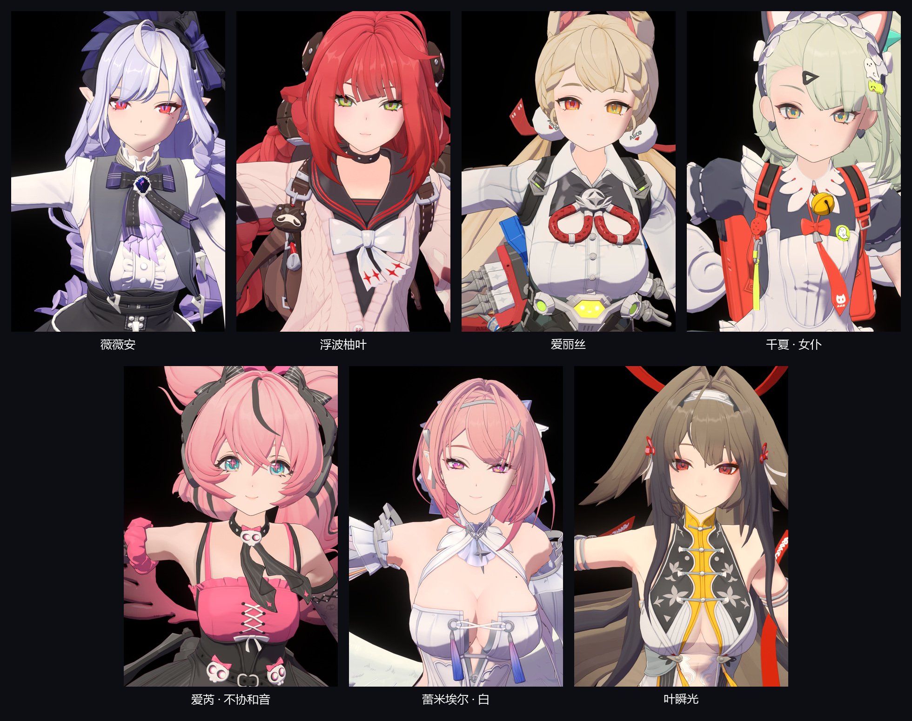
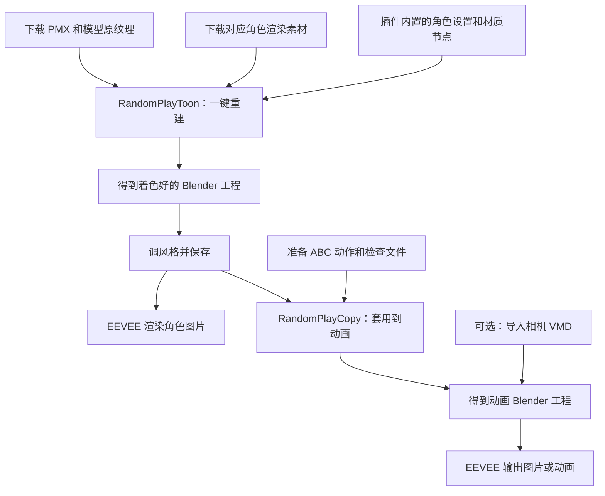

# RandomPlayToon / RandomPlayCopy

把角色模型做成能在 Blender 里直接渲染、自由调风格的工程，并把调好的效果用到动画上。

- **RandomPlayToon**：选择角色 PMX、模型自带的纹理和对应渲染素材，点击“一键重建”，自动做好材质、灯光、描边和刘海透眼。
- **RandomPlayCopy**：选择已经调好的 Blender 工程和匹配的 ABC 动作文件，把角色的渲染效果套用到动画上。

使用 **Blender 5.2 的 EEVEE**。PMX 导入功能已包含在 Toon 安装包中，**不需要另外安装 MMD Tools**。

## 能做出什么效果

图中依次为薇薇安、浮波柚叶、爱丽丝、千夏女仆、爱芮不协和音、蕾米埃尔白版和叶瞬光。

插件会按角色的脸、皮肤、头发、衣服和饰件分别设置材质。你可以调整阴影软硬、颜色、高光、金属反光、描边和发光，也可以让眼睛在刘海后适度显现，同时保留其他部位的遮挡。

要看包含透眼和辉光的完整效果，请按 **F12**，或点击“渲染完整效果”。平时用轻量视口编辑，改完参数后重新渲染即可。

## 先准备哪些文件

| 需要的文件 | 去哪里下载／怎么准备 |
| --- | --- |
| **角色模型包** | 从 [模之屋 / Aplaybox](https://www.aplaybox.com/) 的官方发布页下载。解压后保留 `.pmx` 和模型自带的纹理文件夹，核对发布者和使用条件 |
| **对应角色的渲染素材** | 从 [ZZ-Model-Importer-Assets](https://github.com/leotorrez/ZZ-Model-Importer-Assets/tree/main) 获取。保留角色文件夹中的 `.dds`、`hash.json` 等文件，角色、服装和形态要与模型一致 |
| **Blender** | 从 [Blender 官网](https://www.blender.org/download/) 获取，当前使用 Blender 5.2 |
| **ABC 动作文件及配套检查文件** | 使用 Copy 时才需要。由动画导出流程生成，包含 `.abc`、`metadata.json`、`verification.npz`、`material_animation.npz` |
| **相机 VMD，可选** | 如果动作作者提供了相机文件，可以在 Copy 中单独导入 |

PMX 是角色的模型文件；模型原纹理提供基本颜色；DDS 渲染素材还包含阴影、高光、法线等控制信息。插件会根据已适配的角色设置，把这些文件接到对应材质上。

**仓库和安装包不提供 PMX、游戏原始纹理或渲染素材，也不二次分发它们。** 请自行从原发布渠道获取，并遵守原作者的使用条件。输入文件夹长什么样，见 [安装与文件准备](docs/WORKFLOW.md)。

## 最后会得到什么

| 插件 | 输入 | 输出 |
| --- | --- | --- |
| Toon | PMX、原纹理、对应渲染素材 | 一个新的 `.blend`，保存角色、骨骼和网格表情、材质、灯光、效果及调节面板；另有构建报告 |
| Copy | 保存好的着色 `.blend`、匹配的 ABC 及配套检查文件 | 一个新的动画 `.blend`，保留材质、描边、透眼和调节面板；可加入相机动画；另有套用报告 |

Toon 的结果可以用来拍角色展示图、继续制作动作，或作为 Copy 的材质模板。Copy 的结果可以播放动画并用 EEVEE 输出图片或视频。移动 Copy 工程时，记得一起保留外部 ABC 文件。

## 适合用在哪些地方

适合已经适配的绝区零角色展示、风格调整和动画渲染。效果图展示七个角色；Toon 也适配了部分其他角色、服装、形态和独立武器，具体以插件内的角色设置为准。

模型和贴图需要与已适配版本一致。不同改模或新版本需要另做适配。骨骼和网格表情会保留；通过 PMX 材质变形制作的动态效果，目前还需要额外处理。

Copy 目前支持普通版薇薇安和千夏女仆的匹配动画缓存，并需要配套检查文件。**只有一个普通 ABC 文件时，暂时不能直接套用。** 仓库不包含制作这些检查文件的动画导出器；接入方式见 [工作流程](docs/WORKFLOW.md)。

## 整体流程

## 两个插件怎么用

| Toon：给角色做好材质 | Copy：把材质用到动画上 |
| --- | --- |
|  |  |
| 填写模型、纹理、渲染素材和输出位置，点击“一键重建”。完成后打开结果，也可以查看构建报告 | 填写着色模板、ABC 和输出位置，点击“将渲染效果套用到 ABC”。相机面板负责导入镜头、换算帧率和对齐预热 |

重建后，3D 视图按 **N**，在角色英文名对应的侧栏中调风格。Copy 的风格面板位于 **ABC渲染**。

可以先选“默认、柔和、清晰、暗场”等风格，再调整全局或某个部位。参数包括光向、亮暗、颜色、高光、透明度、描边、透眼和辉光。满意后保存 `.blend`，也可以导出个人预设供以后使用。

- [安装与文件准备](docs/WORKFLOW.md)
- [面板截图、按钮和参数说明](docs/CONTROLS.md)
- [RandomPlayToon 操作说明](addons/random_play_toon/README.md)
- [RandomPlayCopy 操作说明](addons/random_play_copy/README.md)

## Git 保存了哪些东西

保存两个插件的代码、角色设置、必要的节点和校准数据、维护／打包脚本、说明文档及精选图片。模型包、原始渲染素材、动作缓存、完整实验场景、测试输出、日志和生成的 `dist/` 安装包留在本地。

PMX 导入使用内置的 [MMD Tools](https://github.com/MMD-Blender/blender_mmd_tools) 开源代码，保留原作者署名和 GPL 许可证。源码来源与许可见各插件的 `NOTICE` 和 `LICENSE`；角色资产和动作的使用条件仍由原发布者规定。
