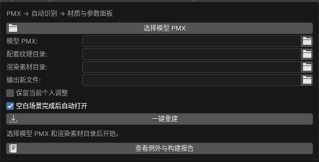
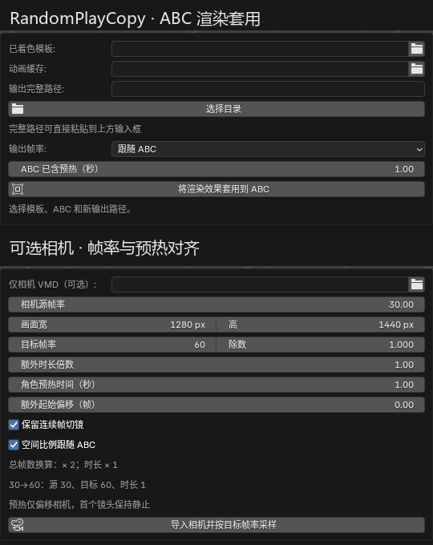
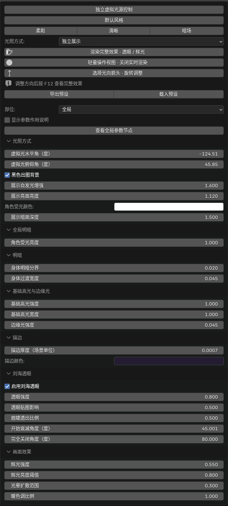
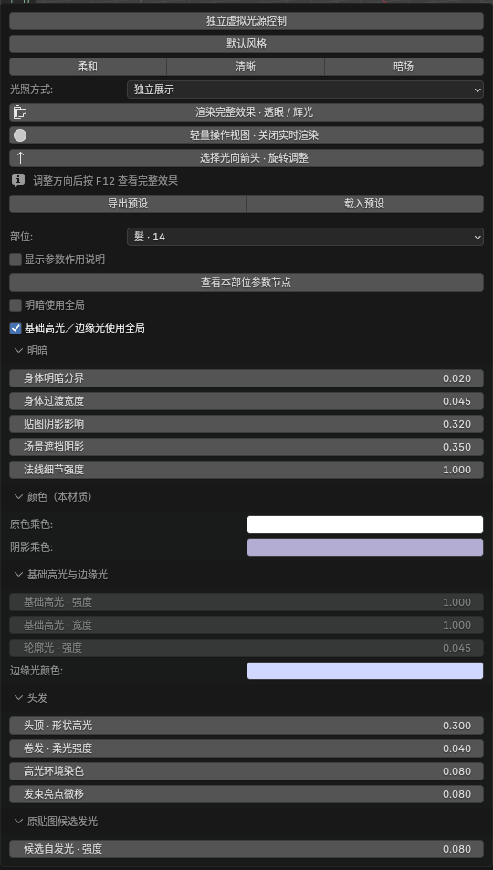

# 面板、按钮与角色参数

3D 视图按 N 打开侧栏。**RandomPlayToon** 制作静态着色模板；**ABC渲染** 将模板效果套用到动画，并管理可选相机。重建后的 Toon 参数页使用角色英文名，Copy 的参数页位于 ABC渲染。

## 构建入口

| Toon | Copy |
| --- | --- |
|  |  |

Toon 的四个文件入口分别是 PMX、配套纹理根目录、渲染素材目录和输出 `.blend`。**一键重建** 完成自动识别和节点构建；**打开重建结果** 切换工程；**查看例外与构建报告** 查看匹配及处理结果。已有着色场景可以勾选 **保留当前个人参数** 后重建。

Copy 的三个文件入口分别是保存好的模板、ABC 和输出 `.blend`。**选择目录** 帮助填写输出位置；**将渲染效果套用到 ABC** 校验并生成工程；**打开结果** 切换工程。**输出帧率** 按秒换算时间轴，**ABC 已含预热（秒）** 供相机对齐使用。任务完成前，结果按钮尚未显示。

## 风格入口

以下截图使用薇薇安场景，展示实际插件面板展开后的全局和头发部位控件，已裁去无关视口。参数按角色和部位生成；其他角色不会出现与其材质无关的控制。

| 全局参数 | 头发部位参数 |
| --- | --- |
|  |  |

| 按钮／控件 | 作用 |
| --- | --- |
| 独立虚拟光源控制 | 应用独立展示光照的预设，以可控的方向与明暗展示角色 |
| 默认风格／柔和／清晰／暗场 | 一次应用一组风格值；柔和弱化明暗与高光，清晰强调分界，暗场适合低亮度展示 |
| 光照方式 | 选择独立展示光照或场景实际灯光，适配展示与场景制作 |
| 渲染完整效果 · 透眼 / 辉光 | 执行 F12 渲染，查看包含眼部可见性层和后期的最终结果 |
| 轻量操作视图 · 关闭实时渲染 | 切换轻量视口，便于编辑；此视口不显示最终合成 |
| 选择光向箭头 · 旋转调整 | 选中光向控制器，用 R 旋转调整受光方向；平移不改变光向 |
| 导出预设／载入预设 | 将个人参数保存为 JSON，或载入保存的参数 |
| 部位 | 选择全局、脸、皮肤、头发、服饰等材质分区，查看相应控制 |
| 显示参数作用说明 | 在面板中展开当前参数的用途说明 |
| 查看全局参数节点／查看本部位参数节点 | 在着色器编辑器定位面板实际控制的节点 |
| 明暗使用全局／基础高光、边缘光使用全局 | 部分部位可继承全局值，或改用本部位值 |
| 肤色同步到脸和皮肤 | 在提供该按钮的皮肤部位，将当前肤色乘色同步到其他皮肤材质 |

预设会替换相关风格数值。需要保留微调时先导出个人预设，调整后保存 `.blend`。修改节点不会自动重渲染已有 F12 图片，需再次渲染。

## 全局参数的用途

| 参数 | 调整什么 |
| --- | --- |
| 独立展示光照 | 控制独立光照分支；配合“光照方式”使用 |
| 角色受光颜色 | 独立光照下对受光、阴影及反光乘色；白色保留原色，自发光和描边另行控制 |
| 展示亮面亮度／展示暗面深度 | 增强独立光照的明面亮度或暗面深度，改变整体对比 |
| 展示自发光增强 | 独立展示下增强原贴图发光遮罩，不改变角色原色 |
| 黑色出图背景 | 最终合成铺黑色背景并输出不透明 Alpha；关闭可保留原透明背景 |
| 虚拟光水平角／虚拟光俯仰角 | 改变卡通受光方向，也可以旋转光向箭头 |
| 角色受光亮度 | 调节整体材质受光强度 |
| 身体明暗分界 | 移动亮暗分界，改变阴影覆盖范围 |
| 身体过渡宽度 | 控制明暗边缘硬度；小值更接近硬边卡通阴影 |
| 基础高光强度／基础高光宽度／边缘光强度 | 调整卡通高光强度、面积和掠视角亮边，不同部位可独立控制 |
| 描边厚度／描边颜色 | 调整轮廓壳厚度与颜色；厚度受模型尺寸影响 |
| 启用刘海透眼 | 开关最终透眼混合，保留场景的遮挡结构 |
| 透眼强度 | 控制眼睛穿过指定前刘海的显现程度 |
| 透眼贴图影响 | 控制透眼结果受刘海贴图信息影响的程度 |
| 眉睫透出比例 | 调节眉毛、睫毛在透眼合成中的显现比例 |
| 开始衰减角度／完全关闭角度 | 从正面向侧面观察时，指定透眼开始变弱和停止的角度 |
| 辉光强度／辉光亮度阈值 | 控制后期光晕强度和开始产生光晕的亮度 |
| 光晕扩散范围／暖色调比例 | 调整光晕扩散和最终合成的整体暖色倾向 |

## 部位参数的用途

| 类别与参数 | 调整什么 |
| --- | --- |
| 原色乘色／阴影乘色 | 分别调整基础色和阴影色；可给不同服饰设独立色调 |
| 部位亮度 | 单独提升或降低所选部位的亮度 |
| 明暗分界／过渡倍率 | 给该部位设置阴影范围与柔和度 |
| 贴图阴影影响／场景遮挡阴影 | 调整已匹配阴影控制图和 EEVEE 场景遮挡的影响 |
| 法线细节强度 | 调整纹理法线对表面明暗细节的影响 |
| 高光强度／宽度／部位高光倍率 | 调整部位高光的显眼程度和面积 |
| 金属、皮革反光强度／粗糙度／反光亮度上限 | 调整对应遮罩内的反光能量、宽度和峰值 |
| 头顶形状高光／卷发柔光强度 | 分别控制贴图定义的头顶高光与发卷宽柔光 |
| 高光环境染色 | 独立展示光照下，让发束高光少量接收真实灯光和环境的颜色 |
| 发束亮点微移 | 随虚拟光俯仰微调高光内部亮度重心，不移动纹理 UV |
| 自发光强度 | 调整眼睛、宝石或饰件等配置部位的发光，配合后期辉光使用 |
| 发光颜色／使用自定遮罩／自定发光遮罩 | 设置发光颜色，可在节点中连接黑白图限定发光区域 |
| 候选自发光强度 | 调整已有素材中接入的发光遮罩分支，与新增饰件发光分别控制 |
| 眼球动态高光／目光亮度、不透明度／目影强度 | 分别控制额外眼部亮点、原高光图层与眼部阴影叠层 |
| 表面不透明度 | 调整支持透明的材质表面 Alpha；刘海透眼由单独参数控制 |
| 部位描边倍率／描边色 | 单独调节该部位的轮廓表现 |
| 脸部阴影边界、柔和度／鼻部阴影／下颌阴影 | 调整跟随头部与光向的面部阴影结构 |
| 丝袜褐色深度、高光宽度、强度、底肤色近似、细织纹 | 调整丝袜底色、亮带和织纹；底肤色是艺术近似，仍保持不透明 |
| 宝石切面闪光、内部亮度、有色透光／切面乘色 | 调整已有切面、内色和透明近似，不执行物理折射 |
| 胸前、背部宝石发光／内光切面对比、深浅层次／发光染色比例 | 独立控制宝石内光，保留原有明暗与切面 |
| 跟随展示自发光增强 | 决定专属宝石内光是否额外叠加全局展示增强 |

材质乘色、法线、高光等作用于节点；透眼和辉光还涉及视图层与合成器。用最终渲染判断参数效果，普通实体视口不显示完整效果。

## Copy 相机与时间轴

| 控件 | 作用 |
| --- | --- |
| 仅相机 VMD | 选择含相机轨道的 VMD；角色动作仍读取 ABC |
| 相机源帧率 | 文件自身的帧率，常见原始相机为 30 fps；已按 60 fps 烘焙的文件填 60 |
| 画面宽／高、目标帧率／除数 | 设置输出分辨率和场景有效帧率 |
| 额外时长倍数 | 额外缩放镜头时长；正常帧率换算保持 1，值 2 表示镜头放慢一倍 |
| 角色预热时间（秒） | 将相机延后到已有缓存预热结束，预热期间保持首镜头 |
| 额外起始偏移 | 额外移动相机的起始帧，处理动作与镜头起点差异 |
| 保留连续帧切镜 | 保留稀疏相机关键帧中的硬切；相机已逐帧烘焙时可关闭 |
| 空间比例跟随 ABC／空间比例 | 将 PMX 相机坐标转换到角色缓存的场景尺寸 |
| 导入相机并按目标帧率采样 | 将 VMD 相机轨道生成 Blender 原生相机动画 |
| 按上述设置重新对齐相机 | 从工程保存的源轨道重新采样，替换本工具相机的手动调整 |
| 同步 ABC 时间轴到当前帧率 | 帧率改变后同步头部控制、时间轴范围和已导入相机 |

相机对齐关系为：

```text
目标帧 = 源帧 × 目标 fps / 源 fps × 额外时长倍数
       + 预热秒数 × 目标 fps + 额外起始偏移
```

例如源相机 30 fps、场景 60 fps、时长倍数 1、预热 1 秒：帧号乘 2 再加 60，镜头本身的秒数不变。相机对齐不会重算角色动作或物理。用户另加的灯光、物体动画需自行对齐。
